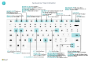

# Nur PC-Tastenkombinationskurzübersicht

#### Allgemein

|Wählen Sie diese Tasten aus|Vorgehensweise|  
|-|-|
|<kbd>Alt</kbd>|Zugriffstasten anzeigen, um in der Aktionsleiste oder im Navigationsmenü zu navigieren|
|<kbd>Alt</kbd>+<kbd>F2</kbd>|Infoboxbereich anzeigen und ausblenden.|
|<kbd>Alt</kbd>+<kbd>N</kbd>|Erstellen eines neuen Datensatzes|
|<kbd>Alt</kbd>+<kbd>Umschalt</kbd>+<kbd>N</kbd>|Schließen Sie einen neu erstellten Datensatz und erstellen Sie einen neuen Datensatz.|
|<kbd>Alt</kbd>+<kbd>O</kbd>|Fügen Sie eine neue Notiz für den ausgewählten Datensatz hinzu|
|<kbd>Alt</kbd>+<kbd>Q</kbd>|Öffnen Sie **Mitteilen**|
|<kbd>Strg</kbd>+<kbd>Alt</kbd>+<kbd>Q</kbd>|**Posten suchen** öffnen|
|<kbd>Alt</kbd>+<kbd>Nach oben</kbd>|Öffnen Sie QuickInfo oder Überprüfungsfehler|
|<kbd>ALT</kbd>+<kbd>NACH-UNTEN-TASTE</kbd>|Dropdown oder Lookup für Anzeige|
|<kbd>Alt</kbd>+<kbd>T</kbd>|Öffnen der Seite **Meine Einstellungen**.|
|<kbd>Alt</kbd>+<kbd>Umschalt</kbd>+<kbd>W</kbd>|Öffnen Sie die aktuelle Karte oder das Dokument in einem neuen Fenster|
|<kbd>Strg</kbd>+<kbd>Einfügen</kbd>|Fügen Sie eine neue Zeile in einem Dokument hinzu|
|<kbd>STRG</kbd>-<kbd>ENTF</kbd>|Löschen Sie die Zeile in einem Dokumenten, Journal oder Arbeitsblatt|
|<kbd>Strg</kbd>+<kbd>Umschalt</kbd>+<kbd>F12</kbd>|Maximieren Sie den Werbebuchungsteil auf einer Dokumentseite|
|<kbd>Strg</kbd>+<kbd>F1</kbd>|Hilfebereich oder Hilfeartikel öffnen|
|<kbd>Strg</kbd>+Klick|Navigieren Sie beim Personalisieren und Anpassen|
|<kbd>Strg</kbd>+<kbd>O</kbd>|Unternehmen oder Umgebung wechseln|
|<kbd>Umschalt</kbd>+<kbd>F12</kbd>|Öffnen Sie den Rollen-Explorer, eine Funktionsübersicht.|
|<kbd>F5</kbd>/<kbd>Strg</kbd>+<kbd>F5</kbd>|Die Seite aktualisieren/neu laden.|
|<kbd>Tab</kbd>/<kbd>Umschalt</kbd>+<kbd>Tab</kbd>|Fokus auf das nächste/vorherige Element richten|
|<kbd>F6</kbd>/<kbd>Umschalt</kbd>+<kbd>F6</kbd>|Weiter zum nächsten Inforegister/Teil|

#### Navigieren und Zeilen auswählen

|Wählen Sie diese Tasten aus|Vorgehensweise|
|-|-|
|<kbd>Start/Ende|Zum ersten/letzten Feld gehen.|
|<kbd>Strg</kbd>+<kbd>Pos1</kbd>/<kbd>Ende</kbd>|Zur ersten/letzten Zeile.|
|<kbd>Strg</kbd>+<kbd>Nach oben</kbd>/<kbd>Nach unten</kbd>|Navigieren Sie ohne die Auswahl zu verlieren|
|<kbd>Strg</kbd>+<kbd>A</kbd>|Alles auswählen|
|<kbd>STRG</kbd>+<kbd>LEERTASTE</kbd>|Toggle-Zeilen-Auswahl|
|<kbd>Strg</kbd>/<kbd>Umschalt</kbd>+Klick|Fügen Sie die Zeile/Zeilen der Angaben hinzu|
|<kbd>Umschalt</kbd>+<kbd>Nach oben</kbd>/<kbd>Nach unten</kbd>|Fügen Sie Zeilen über/unter der Auswahl hinzu|
|<kbd>Umschalttaste</kbd>+<kbd>Bild auf</kbd>/<kbd>Bild ab</kbd>|Sichtbare Zeilen darüber/darunter auswählen|
|<kbd>Strg</kbd>+<kbd>Eingabetaste</kbd>|Fokussieren Sie auf die Liste|

#### Kopieren und einfügen

|Wählen Sie diese Tasten aus|Vorgehensweise|
|-|-|
|<kbd>Strg</kbd>+<kbd>C</kbd>/<kbd>V</kbd>|Zeilen kopieren/einfügen|
|<kbd>F8</kbd>|Kopiere Feld in aktuellen Zeile|

#### Suchen, filtern und sortieren

|Wählen Sie diese Tasten aus|Vorgehensweise|
|-|-|
|<kbd>Alt</kbd>+<kbd>F7</kbd>|Sortieren Sie die ausgewählte Spalte in aufsteigender/absteigender Reihenfolge.|
|<kbd>F3</kbd>|Toggle-Suche|
|<kbd>Umschalt</kbd>+<kbd>F3</kbd>|Wechselt zwischen Filterbereich; Fokus auf Feldfilter|
|<kbd>Alt</kbd>+<kbd>F3</kbd>|Filtern Sie ausgewählte Zellwerte|
|<kbd>Umschalt</kbd>+<kbd>Alt</kbd>+<kbd>F3</kbd>|Filter auf ausgewählten Felder hinzufügen|
|<kbd>Strg</kbd>+<kbd>Alt</kbd>+<kbd>Umschalttaste</kbd>+<kbd>F3</kbd>|Filter zurücksetzen|

#### Schnelleingabe

|Wählen Sie diese Tasten aus|Vorgehensweise|
|-|-|
|<kbd>Strg</kbd>+<kbd>Umschalt</kbd>+<kbd>Eingabetaste</kbd>|Zum nächsten Schnelleingabefeld außerhalb einer Liste navigieren|
|<kbd>EINGABETASTE</kbd>/<kbd>UMSCHALTTASTE</kbd>+<kbd>EINGABETASTE</kbd>|Zum nächsten/vorherigen Schnelleingabefeld navigieren|

##### Berichtvorschau

|Wählen Sie diese Tasten aus|Vorgehensweise|
|-|-|
|<kbd>Strg</kbd>+<kbd>Pos1</kbd>/<kbd>Ende</kbd>|Zur ersten/letzten Seite.|

#### Numerische Tastatur

|Wählen Sie diese Tasten aus|Vorgehensweise|  
|-|-|
|<kbd>ALT</kbd>+<kbd>Dezimaltrennzeichen</kbd>|Schaltet die Ausgabe des Dezimaltrennzeichens auf der Zehnertastatur um|

> [!TIP]
> Für eine grafische, druckfreundliche Version wählen Sie das folgende Bild und laden Sie die PDF-Datei herunter.
>
> 

[!INCLUDE[footer-include](includes/footer-banner.md)]
