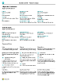

# Arbeiten mit [!INCLUDE[prod_short](includes/prod_short.md)]

Beim Ausführen von Geschäftsaufgaben entsteht auf verschiedene Art und Weise eine Interaktion mit Daten, beispielsweise durch das Erstellen von Datensätzen und die Eingabe von Daten, durch Sortieren und Filtern von Daten, durch Schreiben von Notizen und durch die Ausgabe von Daten in andere Anwendungen.

Sie können beispielsweise die Größe und die Position von Seiten anpassen, die Breite von Spalten und die Höhe der Spaltenköpfe erweitern und die Sortierung der Daten in Spalten ändern. Wenn Sie auf Seiten arbeiten und zum Anzeigen aller Spalten die horizontale Bildlaufleiste verwenden müssen, kann mit einer vertikalen Fixierung der Bildlauf von einigen Spalten beschränkt werden.

[!INCLUDE [about-ui-learn](includes/about-ui-learn.md)]

## Tipps und Tricks

> [!TIP]
> Für einen druckfreundlichen Überblick über die am häufigsten verwendeten Funktionen wählen Sie das folgende Bild und laden Sie die PDF-Datei herunter.
>
> 

## Links zu weiteren Informationen

Die folgende Tabelle enthält die allgemeinen Funktionalitäten mit Links zu den entsprechenden Themen, in denen die Abteilungen beschrieben werden.

> [!NOTE]
> Zusätzlich zu den allgemeinen Benutzeroberflächen-Funktionen, die in diesem Abschnitt beschrieben werden, können Sie weitere allgemeine Funktionen verwenden, die geschäftsverwandter sind. Weitere Informationen finden Sie unter [Allgemeine Geschäftsfunktionen](ui-across-business-areas.md).

| Aktion  | Siehe |
| --- | --- |
|Suchen von bestimmten Seiten, Berichten, Aktionen, Hilfethemen oder Partnererweiterungen. |[Suchen von Seiten und Informationen mit Wie möchten Sie weiter verfahren](ui-search.md) |
|Verschaffen Sie sich einen Überblick über Seiten für Ihre Rolle und für andere Rollen und navigieren Sie zu Seiten.|[Suche nach Seiten mit dem Rollen-Explorer](ui-role-explorer.md)|
| Filtern von Daten in den Ansichten, in Berichten oder in den Funktionen, indem Sie Sonderzeichen und Zeichen verwenden. |[Sortieren, Durchsuchen und Filtern von Listen](ui-enter-criteria-filters.md) |
|Lernen Sie die Vielzahl an allgemeinen Funktionen kennen, die Ihnen dabei helfen, Daten schnell und einfach einzugeben.|[Eingeben von Daten](ui-enter-data.md)|
|Erfahren Sie, wie Sie Daten schnell kopieren und einfügen können, inklusive mithilfe von Tastenkombinationen.|[Kopieren und Einfüge FAQ](faq-copy-paste.yml)|
| Anzeigen oder bearbeiten Sie Daten in bestimmten Zeiträumen. |[Mit Datumsangaben und Uhrzeiten in Kalendern arbeiten](ui-enter-date-ranges.md) |
| Diese Felder müssen ausgefüllt werden. |[Pflichtfelder erkennen](ui-mandatory-fields.md) |
|Verstehen Sie, wie das Computergebietsschema die Benutzeroberfläche und die Hilfesite erfasst und die Sprache geändert wird.|[Sprache und Gebiet ändern](about-locale-language.md)|
|Erfahren Sie, wie Sie mit Excel in [!INCLUDE[prod_short](includes/prod_short.md)] von nahezu überall interagieren können.|[Anzeigen und bearbeiten in Excel](across-work-with-excel.md)|
|Hängen Sie Dateien an, fügen Sie Links hinzu oder schreiben Sie Notizen auf Karten und Dokumente.|[Verwalten von Anhängen, Links und Notizen zu Karten und Dokumenten](ui-how-add-link-to-record.md)|
| Grundeinstellungen wie Unternehmen, Arbeitsdaten und Rollencenter ändern. |[Ändern von grundlegenden Einstellungen](ui-change-basic-settings.md) |
|Erhalten Sie Benachrichtigungen über spezielle Ereignisse oder Statusänderungen, beispielsweise, wenn Sie dabei sind, einen Kunden zu fakturieren, der einen überfälligen Saldo hat.|[Verwalten von Benachrichtigungen](ui-smart-notifications.md)|
| Ändern Sie, welche und wo Benutzeroberflächenelemente passend zu Ihren Vorlieben angezeigt werden.|[Ihren Arbeitsbereich personalisieren](ui-personalization-user.md) |
|Definieren, drucken oder speichern Sie Berichte, zeigen Sie sie als Vorschau an, und definieren Sie Stapelverarbeitungen und führen Sie sie aus.|[Arbeiten mit Berichten, Batchaufträgen und XMLports](ui-work-report.md)|
| Ein Berichtlayout steuert Inhalt und Format des Berichts, auch, welche Datenfelder eines Berichtsdatasets im Bericht erscheinen und wie sie angeordnet werden, Text-Format, Bilder und mehr.|[Verwaltung von Berichts- und Beleg-Layouts](ui-manage-report-layouts.md) |
|Erhalten von Informationen über Funktionen und Funktionen, die einfach [!INCLUDE[prod_short](includes/prod_short.md)] verfügbar sind für  Personen mit Behinderungen.|[Eingabehilfe und Tastenkombinationen](ui-accessibility.md)|

## Navigation in Business Central
Hier finden Sie ein kurzes Video über die Navigation in [!INCLUDE[prod_short](includes/prod_short.md)].

> [!VIDEO https://www.youtube.com/embed/zqz03iMihx0]

## Auswahl eines Desktop-Browsers

[!INCLUDE[prod_short](includes/prod_short.md)] unterstützt mehrere Browser, die jeweils eine Vielzahl von Funktionen und Möglichkeiten bieten. Der Browser spielt eine wichtige Rolle bei der Reaktionsfähigkeit und Flüssigkeit der Benutzeroberfläche. Siehe die Liste der unterstützten, empfohlenen Browser für [Business Central Online](./product-requirements.md) und Browser für [Business Central On-premises](/dynamics365/business-central/dev-itpro/deployment/system-requirement-business-central-v15).

- Vermeiden Sie nach Möglichkeit ältere Browser wie z.B. Internet Explorer und wechseln Sie zu einem unserer empfohlenen modernen Browser, wie z.B. die Aktion [neue Microsoft Edge](https://www.microsoft.com/edge/).  

    Internet Explorer wird nicht mehr unterstützt. Weitere Informationen finden Sie unter [Microsoft Edge-Dokumentation](https://support.microsoft.com/hub/4337664/microsoft-edge-help).
- Halten Sie Ihren Browser immer auf dem neuesten Stand.

## Aktionsleisten

Innerhalb von [!INCLUDE [prod_short](includes/prod_short.md)] erledigen Sie die meiste Arbeit in einer Liste, einem Beleg oder einer Karte. Alle drei Arten von Seiten haben eine Leiste mit Aktionen, die für die jeweilige Seite relevant sind, und die Aktionen sind für die einzelne Karte oder den einzelnen Beleg und für die Liste der Entitäten fast gleich. So können Sie einen einzelnen Verkaufsauftrag auf der Seite **Verkaufsauftrag** und in der Liste **Verkaufsaufträge** verwalten, einschließlich der Buchung und Rechnungsstellung.  

Die Aktionen können aber auch anders aussehen oder gar nicht vorhanden sein, je nachdem, wie Sie die Seite öffnen. Speziell für Listenseiten gilt, dass die Listenseite, die Sie von der Startseite aus öffnen, und die Seite, die gerendert wird, wenn Sie sie über das  Symbol öffnen, sind nicht identisch.  

Wenn Sie eine Listenseite suchen und öffnen, z. B. die Liste **Verkaufsaufträge**, befindet sie sich im Ansichtsmodus. Die Aktionen zum Bearbeiten, Anzeigen oder Löschen einer einzelnen Entität, z. B. eines Verkaufsauftrags, werden angezeigt, wenn Sie die Aktion **Verwalten** wählen.  

> [!TIP]
> Wenn Sie wissen, dass Sie die Aktionen auf dieser zweiten Ebene der Aktionsleiste häufig verwenden werden, wählen Sie das Symbol :::image type="icon" source="media/pin.png" border="false":::, um die Aktionsleiste anzuheften und die Aktionen unter den verschiedenen Menüs sofort auffindbar zu machen.
>
> Um die zweite Ebene der Aktionsleiste wieder verschwinden zu lassen, wählen Sie das Symbol :::image type="icon" source="media/unpin.png" border="false":::.

Wenn Sie aber dieselbe Listenseite von Ihrer Startseite aus öffnen, ist die Aktion **Verwalten** nicht vorhanden. Um einen einzelnen Verkaufsauftrag zu öffnen, wählen Sie stattdessen einfach das Feld **Nummer**. In dieser Ansicht können Sie die Aktionsleiste nicht anheften.  

## Siehe verwandte [Microsoft Schulungen](/training/paths/work-pro-data-dynamics-365-business-central/)

## Siehe auch

[Bereitschaft für die Geschäftsabwicklung](ui-get-ready-business.md)  
[Einrichten von Business Central](setup.md)  
[Allgemeine Geschäftsfunktionen](ui-across-business-areas.md)  
[Performance-Tipps für Geschäftsanwender](/dynamics365/business-central/dev-itpro/performance/performance-users?toc=/dynamics365/business-central/toc.json)

## [!INCLUDE[prod_short](includes/free_trial_md.md)]

[!INCLUDE[footer-include](includes/footer-banner.md)]
